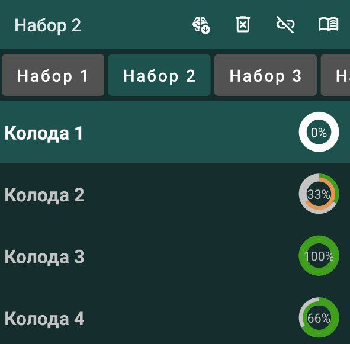
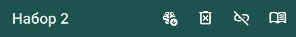
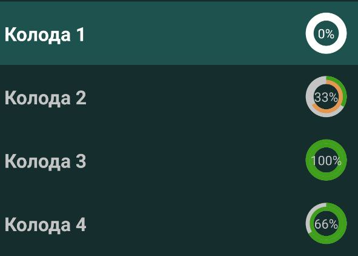

# Раздел 1: Главная страница приложения

 

## 1. Панель инструментов:
 
1. Название выбранного набора колод 

2. Добавить пользовательский набор колод: 

   - Чтение файла с набором колод из локальной директории;
   - Для чтения доступны файлы форматов csv и txt размером до 100 кб. При несоблюдении этих требований файл не загрузится и будет показано соответствующее уведомление;
   - Файл должен быть написан в соответствии с синтаксисом, предусмотренным приложением. Такие файлы находятся в библиотеках приложения либо создаются лично по соответствующей инструкции;
   - После прочтения, информация сохраняется в приложении и файл может быть удален с устройства.
3. Удалить набор колод: 

   - Информация выбранном о наборе колод полностью стирается из памяти приложения.
4. Очистка списка доверенных ссылок: 

   - Все ссылки, отмеченные пользователем как "доверенные" будут перепроверены (см. раздел "Безопасность ссылок").
6. О приложении:  

  - Ссылки на инструкции к приложению и библиотеки, контактные данные владельца приложения.

## 2. Список сохраненных наборов колод: 
 
   - Выбор осуществляется нажатием на плашку интересующего набора колод;
   - Выбранный набор колод выделен основным цветом приложения;
   - Прокручивается в стороны.
   
## 3. Список колод из выбранного набора: 
 
   - Выбор осуществляется нажатием на строку интересующей колоды;
   - Последняя выбранная колода выделяется основным цветом приложения
### 3.1 Строка выбора колоды: 
 
 - Название колоды; 

 - Индикатор прогресса прохождения колоды: 
 
    - Цифра — прогресс последнего прохождения колоды в процентах;
    - Зеленая дуга — визуализация прогресса последнего прохождения колоды;
    - Желтая дуга — визуализация лучшего результата прохождения колоды.
    При достижении лучшего результата 100% меняет цвет на зеленый навсегда. 
    
 

 
 

# Раздел 2: Практическая страница приложения

 

## 1. Панель инструментов:
 
1. Счет заданий  
   
   - Количество пройденных заданий  
     
   - Количество заданий в колоде  
     
2. Автоматические предложения клавиатуры:
   - Включенное состояние оставляет клавиатуру в привычном виде  
   
   - Выключенное состояние выключает автоматические предложения клавиатуры, переводя ее в режим ввода пароля  
      
   - Состояние меняется путем нажатия на иконку.
3. Подтверждение демонстрации ответа
   - Включенное состояние вызывает всплывающее окно подтверждения демонстрации ответа после нажатия на кнопку "Показать ответ"  
   
   - Выключенное состояние игнорирует всплывающее окно подтверждения демонстрации ответа, показывая ответ сразу после  нажатия на кнопку "Показать ответ"  
     
   - Состояние меняется путем нажатия на иконку.
4. Изучать  
   
   - Переход на "Теоретическую страницу"
   - Смотри раздел "Теоретическая страница"  

## 2. Поле вопроса:  

   - Описание задания для выполнения.
   - Может содержать ссылки на дополнительные материалы
 

## 3. Поле ответа:  
  

- Каждое введенное в процессе внесения ответа слово проверяется по отдельности
- Слово, введенное неправильно (в том числе не до конца), выделяется серым цветом
    
- Слово, введенное правильно, выделяется цветом панели инструментов
    
- Окно ответа различает знаки по регистру
    
- Знак ' считается отдельным словом вне зависимости от наличия и количества пробелов между соседними символами
    
- Полностью правильный ответ выделяется зеленым цветом и блокирует поле ввода
    
- Слова ответа принимаются правильными вне зависимости от количества пробелов между ними
    
- Слова ответа принимаются правильными только по порядку
    
 

## 4. Кнопка 'Показать ответ'
  

- Показывает правильный ответ. При этом вопрос не засчитывается отвеченным. Ответ по-прежнему должен быть вписан в соответствующее поле.
- Если внесен правильный ответ, кнопка меняет текст на 'Далее' и служит для перехода к следующему вопросу.
    
- Если вопрос был последним, кнопка меняет текст на 'Завершить' и служит для возвращения на главную страницу
    

## 5. Вспомогательные кнопки
  

- Вспомогательная кнопка вставляет текст, который на ней написан, в поле ввода ответа.

- Вспомогательные кнопки могут быть или не быть в зависимости от оформления карточки.
 
